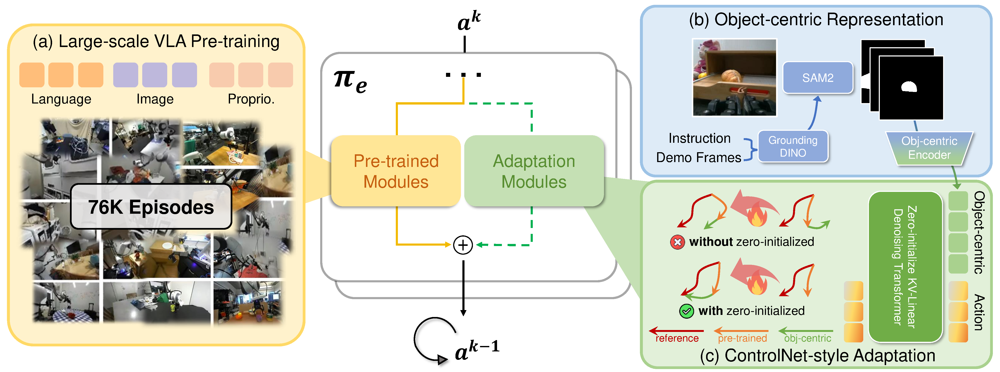

# ControlVLA: Few-shot Object-centric Adaptation for Pre-trained Vision-Language-Action Models

[💻 [Project page](https://controlvla.github.io/)]
[📄 [Paper](https://www.arxiv.org/abs/2506.16211)]

[Puhao Li](https://xiaoyao-li.github.io/)<sup>1,2</sup>,
[Yingying Wu]()<sup>1</sup>,
[Ziheng Xi](https://scholar.google.com/citations?user=2jhxMu0AAAAJ&hl=en)<sup>1</sup>,
[Wanlin Li](https://scholar.google.com/citations?user=n_mYangAAAAJ&hl=zh-CN)<sup>2</sup>,
[Yuzhe Huang]()<sup>2</sup>,
[Zhiyuan Zhang](https://scholar.google.com/citations?user=BS7FuB0AAAAJ&hl=en)<sup>1</sup>,
[Yinghan Chen]()<sup>3</sup>,
[Jianan Wang](https://scholar.google.com/citations?user=mt5mvZ8AAAAJ&hl=en)<sup>4</sup>,
[Song-Chun Zhu](https://zhusongchun.net/)<sup>1,2,3</sup>,
[Tengyu Liu](https://tengyu.ai/)<sup>2, ✉️</sup>,
[Siyuan Huang](https://siyuanhuang.com/)<sup>2, ✉️</sup>

<sup>1</sup>Tsinghua University,
<sup>2</sup>Beijing Institute for General Artificial Intelligence (BIGAI),
<sup>3</sup>Peking University,
<sup>4</sup>AstriBot.


*ControlVLA* is a general framework for few-shot object-centric adaptation for pre-trained VLA models. It can be used to adapt pre-trained VLA models to task- and environment-specific skills **with only 10-20 expert demonstrations**.

## 🛠️ Installation
1. Create a virtual environment through `conda` or other python package managers.
    ```bash
    conda create -n controlvla python==3.9.18
    conda activate controlvla
    ```

2. Install `torch` and other dependent libraries.
    ```bash
    pip install torch==2.1.0+cu121 torchvision==0.16.0+cu121 --extra-index-url https://download.pytorch.org/whl/cu121
    pip install -r requirements.txt

    ## install sam2 from the source code
    cd thirdparty
    git clone https://github.com/facebookresearch/sam2.git
    git checkout 7e1596c0b6462eb1d1ba7e1492430fed95023598
    ## remove the python and pytorch version restrictions in sam2 setup config
    cd sam2 && pip install -e .
    ```
    - The code is tested on `pytorch 2.1.0` and `cuda 12.1`, other versions may have compatibility issues.

3. Download the pre-trained model:
    - Pre-trained ControlVLA model [here](https://github.com/facebookresearch/sam2/tree/main?tab=readme-ov-file#download-checkpoints), unzip and place it in the `./data` folder.
    - SAM2 model following the instructions [here](https://github.com/facebookresearch/sam2/tree/main?tab=readme-ov-file#download-checkpoints) and place it in the `./data/checkpoints` folder. Note that the default config uses checkpoint `sam2_hiera_tiny.pt`. You can simply download the default checkpoint with wget: `cd data/checkpoints && wget https://dl.fbaipublicfiles.com/segment_anything_2/072824/sam2_hiera_tiny.pt`.

## 🗃️ Data Collection
> Note that our data is collected and pre-processed with [UMI](https://github.com/real-stanford/universal_manipulation_interface) system, which provides robot-arm-agnostic training data. You may also collect data with your own robot setup for faster validation and deployment.

1. Collect data with [UMI data pipeline](https://github.com/real-stanford/universal_manipulation_interface?tab=readme-ov-file#running-umi-slam-pipeline) system, and get the `replay_buffer.zarr.zip` data file. An example of this zarr data file is provided [here](https://drive.google.com/file/d/1VtpxxzMw-tMH4IV7yLHdFPXWzn6vNzSS/view?usp=sharing).

2. Annotate the interactive parts for each object for SAM2.
    ```bash
    python scripts_objcen_pipeline/prompts_annotation.py -i ./example_finetune_demo/picknplace_toy.d10
    python scripts_objcen_pipeline/prompts_extraction.py -i picknplace_toy.d10
    ```
    You can also use [GroundingDINO](https://github.com/IDEA-Research/GroundingDINO) to automatically annotate the interactive parts with task language instructions.

3. Process and integrate the object-centric masks into the data file.
    ```bash
    python scripts_objcen_pipeline/08_propagate_interactive_parts.py -i ./example_finetune_demo/picknplace_toy.d10
    python scripts_objcen_pipeline/09_integrate_into_dataset.py -i ./example_finetune_demo/picknplace_toy.d10
    ```

## 🦾 Fine-tuning and Deployment
Finetune the pre-trained ControlVLA model on example dataset with the following command:
```bash
bash runs/controlvla_pnptoy.sh
```

For real-world deployment, customize your robot and camera interface for the inference script `eval_controlvla.py`. Then run:
```bash
python eval_controlvla.py -i ./data/checkpoints/latest.ckpt -p ./example_finetune_demo/picknplace_toy.d10/picknplace_toy.d10.objectcentric.anno.pkl
```

## 👏 Acknowledgments
We thank [Yuyang Li](https://yuyang.li/), [Yuwei Guo](https://guoyww.github.io/), and [Ziyuan Jiao](https://sites.google.com/g.ucla.edu/zyjiao/home) for their valuable discussions and technical support. This work builds upon the codebase of [UMI](https://github.com/real-stanford/universal_manipulation_interface).

## 🔗 Citation
If you find this work useful, please consider citing:
```bibtex
@article{li2025controlvla,
  title={ControlVLA: Few-shot Object-centric Adaptation for Pre-trained Vision-Language-Action Models},
  author={Li, Puhao and Wu, Yingying and Xi, Ziheng and Li, Wanlin and Huang, Yuzhe and Zhang, Zhiyuan and Chen, Yinghan and Wang, Jianan and Zhu, Song-Chun and Liu, Tengyu and others},
  journal={arXiv preprint arXiv:2506.16211},
  year={2025}
}
```
If you have any questions about this work, feel free to contact Puhao Li at puhaoli01@gmail.com
